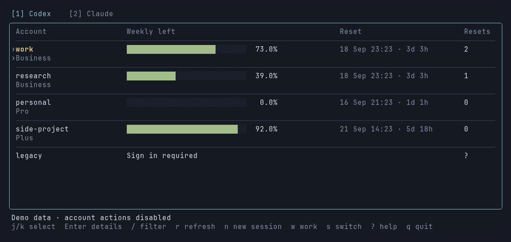
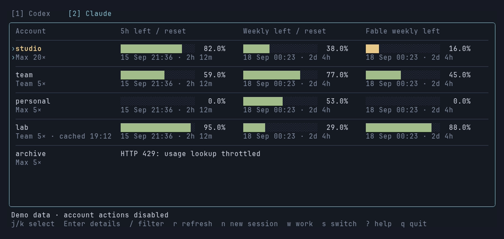
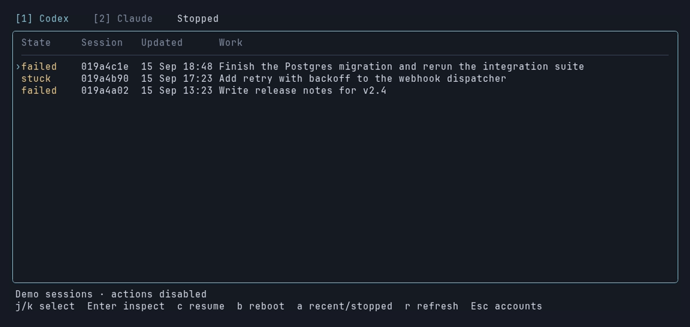

# Hotseat

A terminal dashboard and CLI for the Claude Code and Codex accounts on your
machine. It shows how much quota each account has left, when every window
resets, which account your sessions are using, and which conversations a usage
limit stopped, so you can pick them up again on an account that still has room.



Everything runs locally. Hotseat reads the credential files the `claude` and
`codex` CLIs already keep, asks the providers' own usage endpoints for quota (no
inference requests), and never sends a token anywhere else.

## Why

If you work across several Claude and Codex accounts, the questions come up
constantly: which account has quota for the model I need, when does the one I
just exhausted reset, which account is this terminal actually on, and what was
that session doing when it stopped at a limit three hours ago? The CLIs answer
none of these. Hotseat answers all of them from one screen.

## Install

```bash
uv tool install hotseat        # or: pipx install hotseat
hotseat tui
```

Until the first PyPI release lands, install straight from GitHub:

```bash
uv tool install git+https://github.com/Maxteabag/hotseat
# or: pipx install git+https://github.com/Maxteabag/hotseat
```

The PyPI wheels bundle the prebuilt terminal interface for Linux and macOS on
x86_64 and arm64, so `hotseat tui` works straight away. An install without a
bundled binary (git, sdist) fetches the matching `hotseat-tui` from the
[GitHub release](https://github.com/Maxteabag/hotseat/releases) for its own
version on first run, verifies it against the release's SHA-256 checksums, and
caches it under `~/.local/share/hotseat/bin/`. Set `HOTSEAT_NO_DOWNLOAD=1` to
forbid that, or `HOTSEAT_TUI_BIN` to point at a binary of your own.

The Python side has no third-party dependencies and needs Python 3.10 or newer.
The `claude` CLI is needed for Claude accounts and the `codex` CLI for Codex
accounts; they perform the sign-in and, for Codex, serve live quota.

From a checkout:

```bash
git clone https://github.com/Maxteabag/hotseat && cd hotseat
python3 -m pip install .
go build -o bin/hotseat-tui ./cmd/hotseat-tui   # Go 1.25 or newer
hotseat tui          # finds bin/hotseat-tui first
hotseat tui --demo   # synthetic accounts, no network, no actions
```

## The terminal interface

Built with Bubble Tea v2, Bubbles and Lip Gloss. Two tabs, one per provider,
and a separate Work screen so the account view stays uncluttered.

**Codex** shows each saved profile's weekly quota bar, the reset date with a
countdown, and how many usage-reset credits the account has available. The
current default account is drawn in yellow.

**Claude** shows three bars per account: the 5-hour window, the 7-day window,
and the 7-day Fable window, each with its own reset time. The plan label carries
the subscription multiplier from the account's own metadata, so **Max 5×**,
**Max 20×** and **Team 5×** are told apart.



**Work** lists sessions that failed or got stuck, with the conversation title,
when it last moved, and its working directory. Enter shows what the session
was asked and what it last said. From there you can resume the conversation, or
reboot a native process that is holding a conversation lock while going
nowhere. Both actions ask for confirmation.



The screen refreshes every 15 seconds. Claude's usage endpoint is asked at most
once per account per minute, with exponential backoff and `Retry-After` on
HTTP 429; the UI keeps the last good reading visible with its timestamp while
throttled. A quota the API did not report is labelled as such, never shown as
zero, and a reset time that has passed reads `due; refresh` rather than
pretending the quota came back.

| Key | Action |
|---|---|
| `1` / `2` | Codex or Claude tab |
| `j` `k` `PgUp` `PgDn` | Move through accounts |
| `Enter` | Identity details and full error text |
| `/` | Filter by alias, email, provider or workspace |
| `n` | Open a new session pinned to the selected account |
| `s` | Make the selected account the machine-wide default (asks first) |
| `w` | Work screen: `Enter` inspect, `c` resume, `b` reboot, `a` include recent sessions |
| `r` | Refresh now (does not bypass the API cooldown) |
| `?` / `q` | Help / quit |

Duplicate credential profiles for the same identity share a row; the details
view lists all of their names. Narrow terminals stack the quota windows
vertically.

## The command line

Every subcommand takes `--json`, so anything the TUI shows can be scripted.

```bash
hotseat list                    # Claude accounts: quota, status, sign-in deadline
hotseat codex                   # Codex accounts and their quota
hotseat show work               # everything known about one account
hotseat verify work             # one minimal request to prove the account works
hotseat use work                # run a session pinned to that account, here
hotseat use work --model opus   # extra arguments pass through to claude
hotseat window work             # same, in a new terminal window
hotseat switch work             # change the machine-wide default (asks first)
hotseat refresh                 # renew expired access tokens of saved profiles
hotseat resets                  # available Codex usage-reset credits (read only)
hotseat models                  # token usage by model, last 7 days
hotseat statusline              # "◆ work · you@example.com", for a status line
hotseat sessions                # recent Codex sessions and what each one needs
hotseat nudge <id> "continue"   # message a running Codex session
hotseat reboot <id>             # close a stuck Codex session and resume it
hotseat resume                  # work a usage limit stopped
hotseat inspect <id>            # what a stopped session was doing
hotseat serve                   # local web dashboard
```

Exit codes: 0 success, 1 failed operation, 2 usage error.

### Pinning versus switching

`hotseat use <alias>` gives the session its own config directory under
`~/.claude-accounts/<alias>/` holding only identity and credentials; settings,
skills, hooks and project history are symlinked back to the shared config.
Nothing else on the machine notices. The directories are permanent by design:
a session rotates its refresh token, and a throwaway directory would strand the
rotated value. Pinned Codex sessions work the same way, using the saved profile
directory as their `CODEX_HOME`.

`hotseat switch <alias>` rewrites the shared credential file that every running
process reads, retargeting all of them mid-conversation. It counts those
sessions and asks before proceeding; without a terminal it refuses unless given
`--yes`.

Add `hotseat statusline` to Claude Code's `statusLine` setting and a pinned
session names its account. A session on the shared configuration says
`default`, so the two are never confused.

### Expired tokens and sign-in deadlines

A Claude access token lives about eight hours. A pinned session renews its own
as it works, but a saved profile nobody has used since yesterday simply expires,
and its quota cannot be read. Hotseat renews it: when a quota read meets an
expired profile it refreshes the token first, and `hotseat refresh` does the
same on demand for every expired profile, or for named ones with `--force`.

The refresh is delegated to the `claude` CLI rather than reimplemented. A
throwaway config directory is seeded with only that profile's credentials, one
minimal Haiku request under a two-cent budget drives the CLI's own
refresh-and-rotate path, and the rotated credentials are backed up before they
replace the stored copy atomically. The shared configuration and running
sessions are never touched. If a pinned session directory already holds a newer
token, that is adopted instead and no request is spent. A failed automatic
refresh is not retried for an hour; `HOTSEAT_NO_REFRESH=1` turns the automatic
path off entirely.

Renewing an access token does not extend the refresh window, so every Claude
account has an interactive-login deadline of roughly a month that no activity
postpones. `hotseat list` shows it, and it turns red inside seven days. Past
that point the TUI says "Sign in required", which is the honest answer.

## Codex accounts

Codex keeps one live credential in `~/.codex/auth.json` and saved accounts under
`~/.codex/profiles/`. Hotseat bundles the profile helpers, so nothing outside
this repository is needed beyond the `codex` CLI itself.

```bash
hotseat codex-account list
hotseat codex-account save work
hotseat codex-account switch work
hotseat codex-account login personal --email you@example.com
hotseat codex-account verify work
```

Identity comes from the claims in each stored `id_token`, read locally.
Accounts are matched on account id as well as email, since one address can
belong to several workspaces. Switching preserves the outgoing login and
refuses when the current-profile marker does not match what is on disk. A live
account that was never saved is called out, because a switch would overwrite
it.

Quota is read through an isolated `codex app-server` per profile, one at a
time, without touching the live account. That costs a process per account, so
the dashboard accepts a reading up to half an hour old and says how old it is.
The CLI probes fresh because you just asked.

Rebooting a Codex session matters because of two mechanics: a conversation has
one writer lock, so a second `codex resume` is refused rather than taking over,
and a running session reads credentials once at startup, so switching accounts
never reaches it. `hotseat reboot` terminates the holder gently, waits for the
lock to clear, then resumes the same conversation on the current account.

## Continuing work a limit stopped

Hitting a limit does not fail in a way you can act on later. A terminal session
prints one line and waits, and hours later there is no list of what stopped.

```bash
hotseat resume            # what stopped, and whether it can continue now
hotseat resume --days 30  # look further back
hotseat inspect bd98a474  # working directory, branch, last request, last reply
```

A native session qualifies when the last entry in its transcript is the limit
error, so a limit that was worked through counts as history. Quota is checked
before anything is continued: an account that is still rate limited is a hard
block, while a spent limit for one model family is a warning, since the resumed
work may not use that family. Each native Claude session is listed with a
ready-to-paste `claude --resume` command and its working directory; the TUI's
Work screen covers Codex sessions as well.

## The web dashboard

`hotseat serve` starts a loopback-only web view over the same data with Launch,
Verify and Make-default buttons. It rebuilds a snapshot only when a request
arrives and the cached one has aged past `--interval`, and exits after thirty
minutes without requests. Every state-changing request must carry a token minted
when the page loads; foreign origins are refused. `--host` binds elsewhere and
the process warns that this exposes account controls to anyone who can reach
the port.

## Optional Clarp integration

If you run [Clarp](https://github.com/Maxteabag/clarp) agents, a separate plugin
adds agent monitoring, conversation inspection and supervised recovery:

```bash
python3 -m pip install ./plugins/clarp
```

`hotseat clarp` lists agents and the account each running one is spending;
`hotseat resume --go` continues agents that a usage limit parked, once an
account can serve their model. The core never imports the plugin. Uninstall
`hotseat-clarp` to remove it, or set `HOTSEAT_PLUGINS=none` to disable
discovery. See [plugins/clarp/README.md](plugins/clarp/README.md) and
[docs/plugins.md](docs/plugins.md) for the plugin API.

## Where the numbers come from

Claude quota comes from Anthropic's OAuth usage endpoint, the same one the
Claude apps use. It costs no inference, still answers while the account is rate
limited, and reports per-model weekly limits. A header-probe fallback exists for
when that endpoint is unavailable; an account served by it says so, because the
fallback cannot see per-model limits. Codex quota comes from the `codex`
app-server's own rate-limit report. Details are in
[docs/quota-data.md](docs/quota-data.md).

Access tokens are never written to a response body, a log line or a command
line. The only place one is passed is the environment of a session you
explicitly launch.

On macOS, Claude credentials live in the login Keychain, so the Mac build is
read-only: quota and deadlines are shown, management controls are hidden.

## Development

```bash
python3 -m unittest discover -s tests -t .                        # core
PYTHONPATH=plugins/clarp python3 -m unittest discover -s plugins/clarp/tests
go test ./... && go vet ./...                                     # TUI
```

The tests use temporary directories and fixture data throughout; none read
real credentials or make a network request. CI runs them on every push and
pull request, then builds the wheels and installs one into a clean temporary
home with a fake `codex` binary to prove quota reads and switching work
without a checkout (`scripts/check_packaged_helpers.py`).

Releases are cut by tagging: bump `__version__` in `hotseat/__init__.py`, tag
the commit `vX.Y.Z`, and push the tag. The release workflow cross-compiles the
TUI, builds an sdist plus one wheel per platform with the binary inside
(`scripts/build_wheels.py`), publishes `hotseat` and `hotseat-clarp` to PyPI
through trusted publishing, and attaches the standalone binaries with
checksums to a GitHub release.

The README screenshots are generated with [VHS](https://github.com/charmbracelet/vhs)
from synthetic data:

```bash
python3 docs/make_fixture.py     # writes docs/demo-fixture.json
vhs docs/screenshots.tape        # writes docs/*.png
```

Layout: the Python core in `hotseat/` knows nothing about either front end.
The TUI (`cmd/hotseat-tui`, `internal/tui`) and the dashboard
(`hotseat/web/index.html`) call the same functions through `hotseat.tui_bridge`
and `hotseat.server`.

## License

MIT
